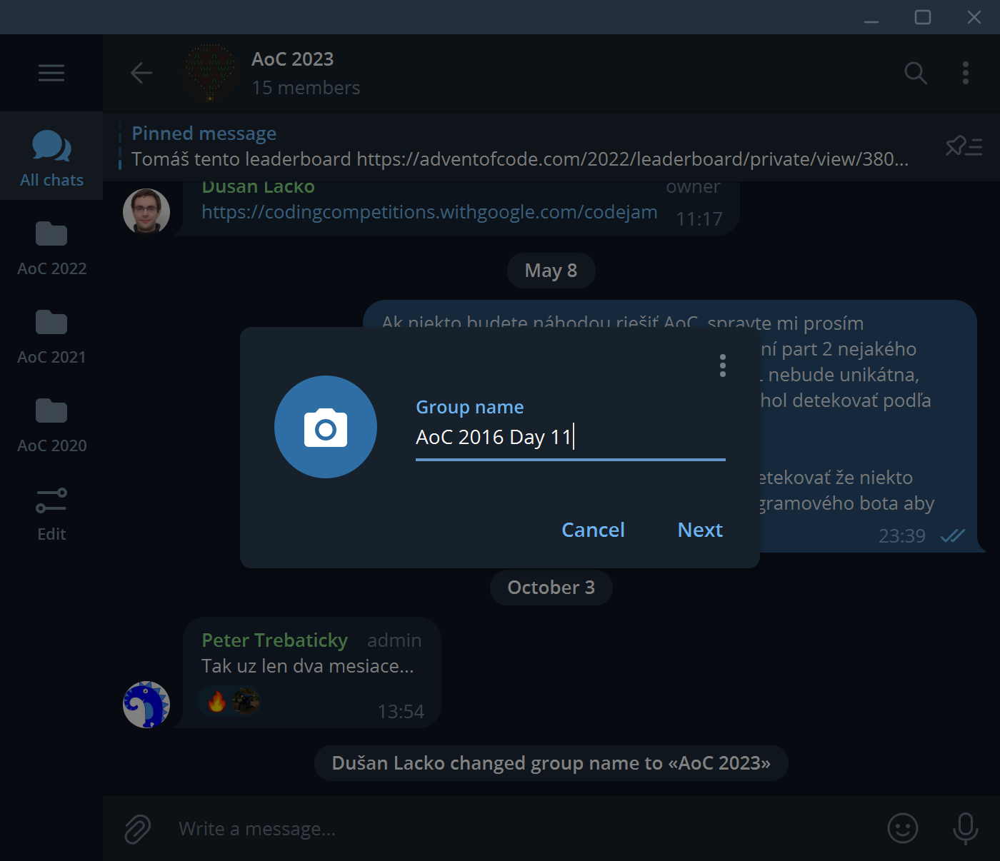
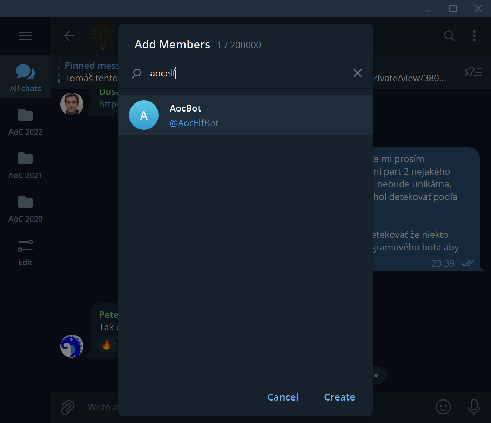
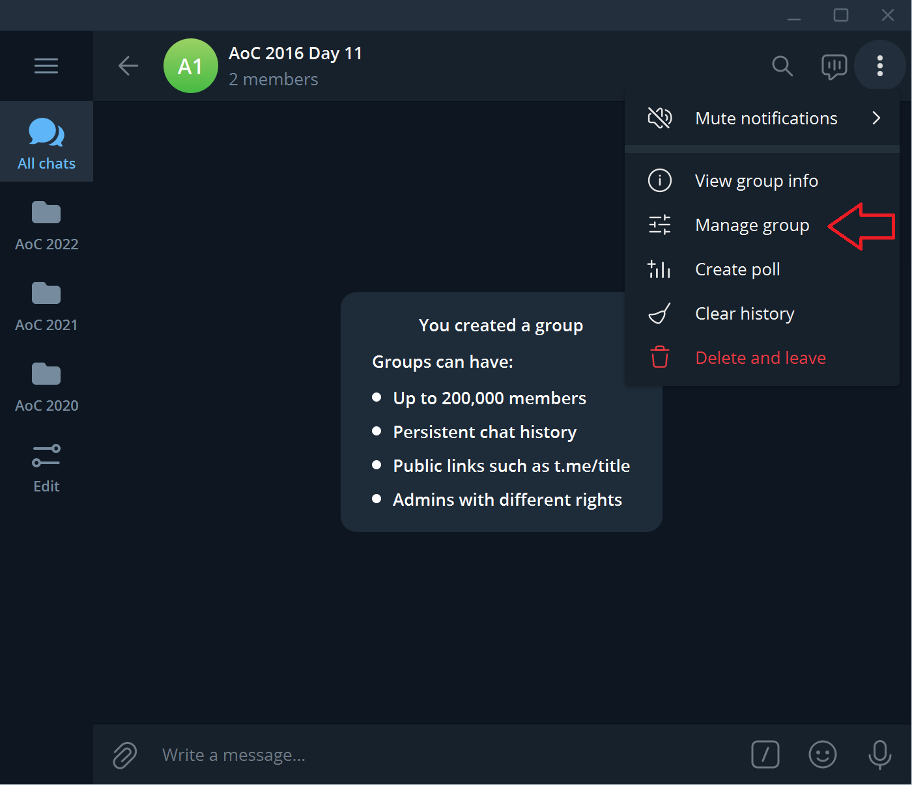
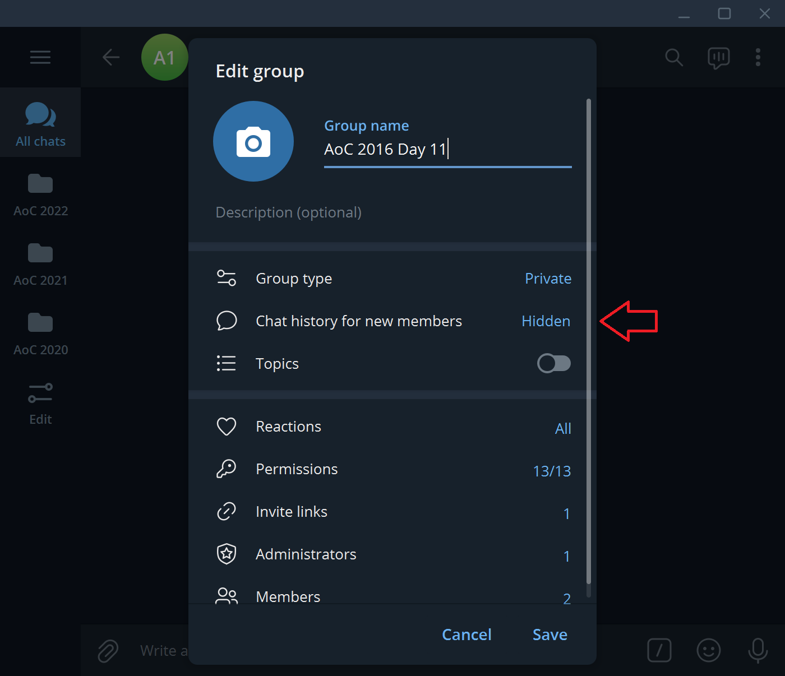
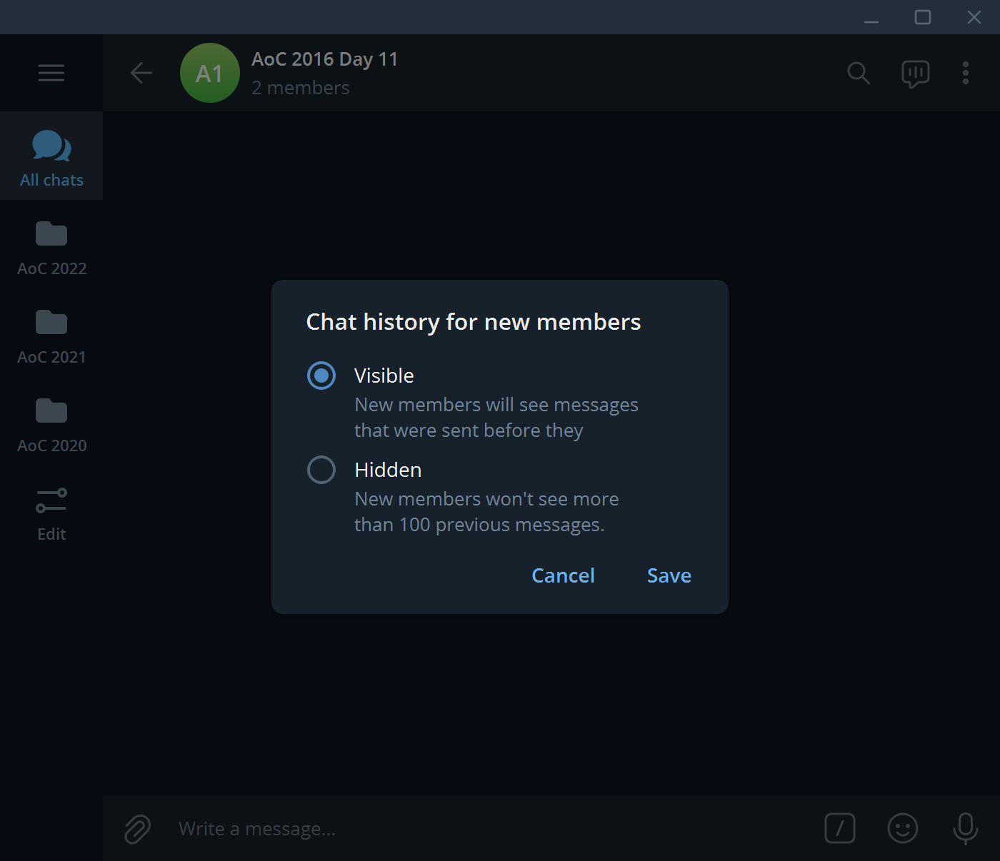
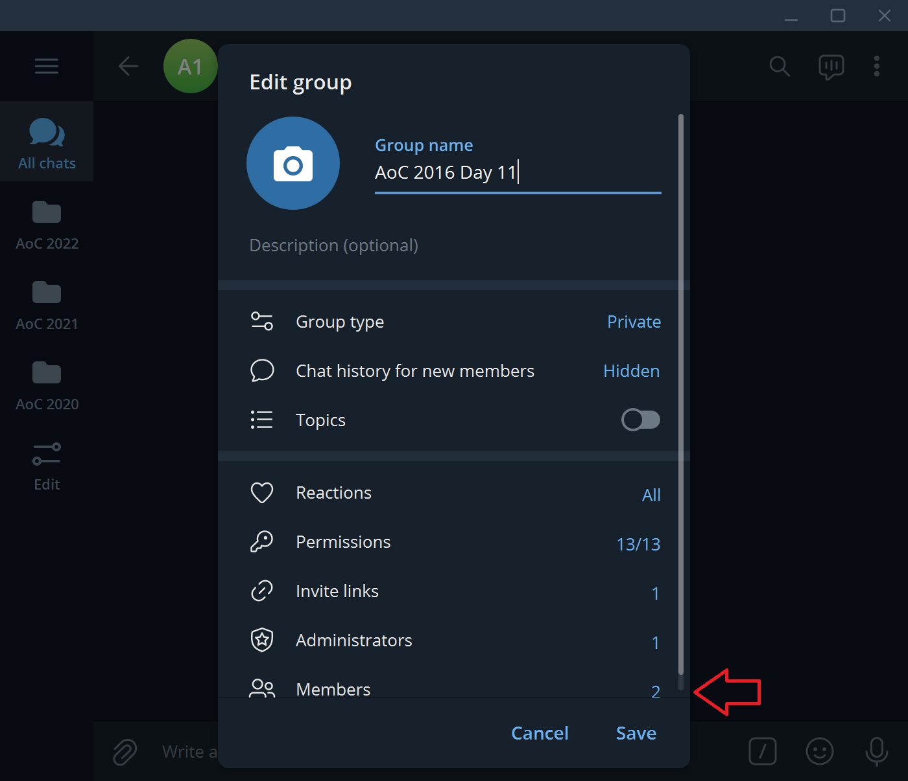
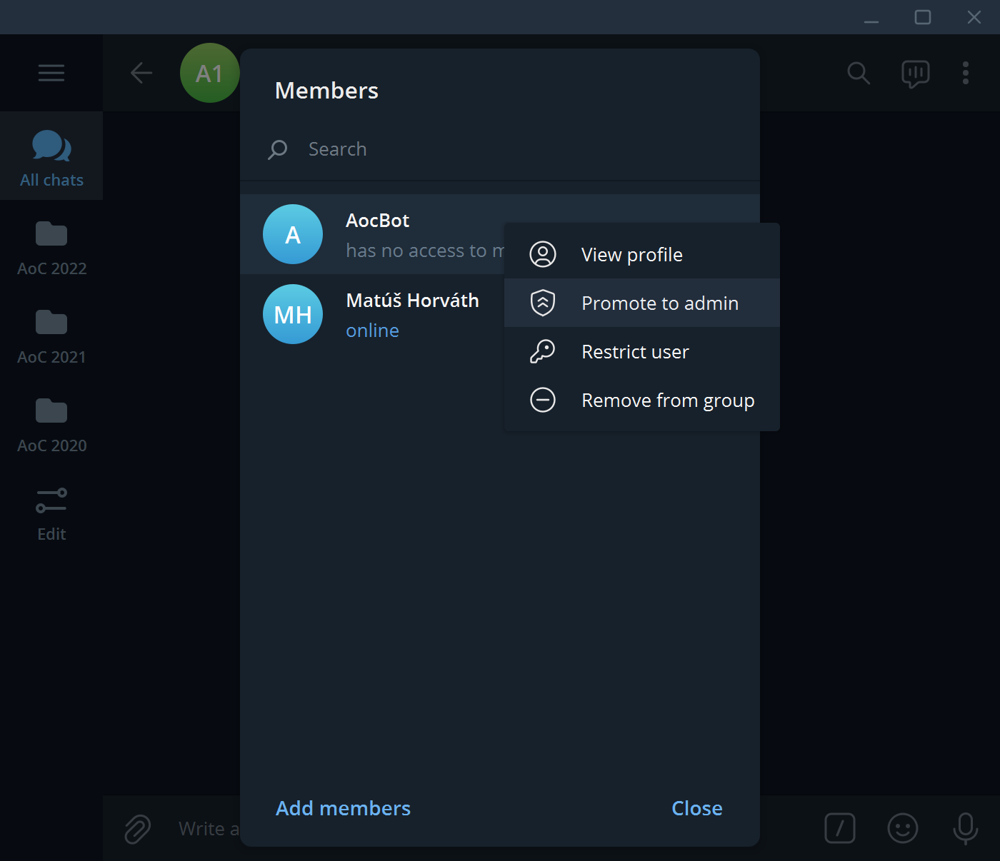

# Creating a Group for AoC

1. Create a new group. Group name should be `AoC YYYY Day DD`, e.g. `AoC 2016 Day 11`.

   

1. Add `@AocElfBot` into the group.

   

1. In the "Manage group" menu, set "Chat history for new members" to "Visible".

   
   
   

1. In the same "Manage group" menu, select the list of members, right click on `@AocElfBot` and promote it to admin. Use default access rights for the bot.

   
   
   

1. If everything goes well, the bot will set up the new group and create a pinned message with the leaderboard.

   

If the bot stops working in a group for any reason, it is generally safe to demote it to regular user and promote it back to admin. This will re-initialize the bot for this group.
